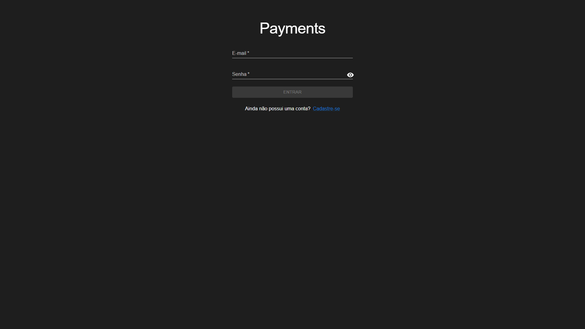
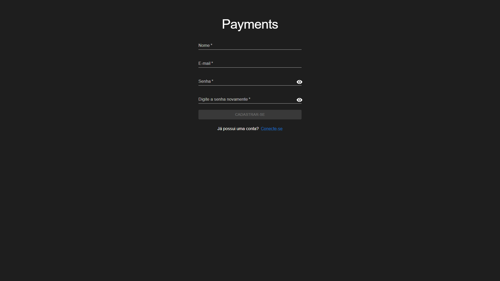
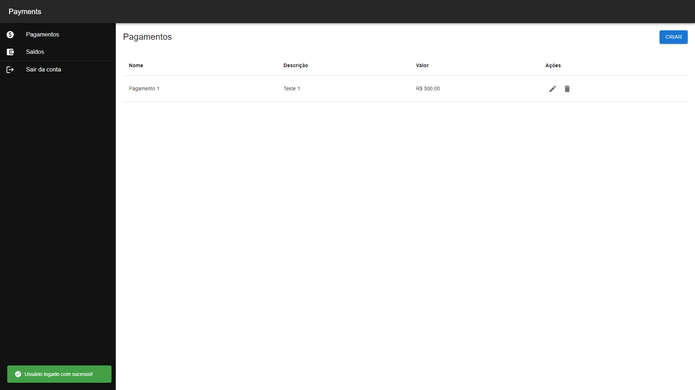
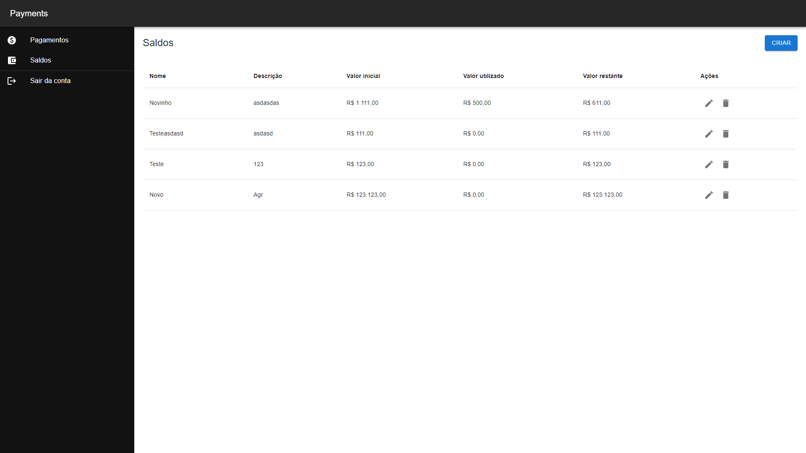
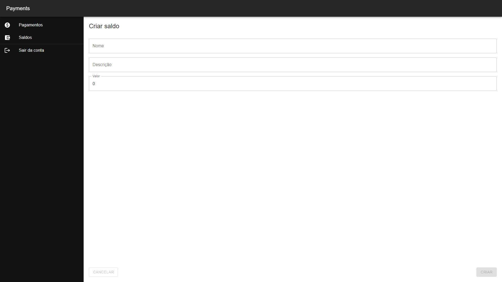

# Payment Platform

⚛️ A React and NestJS monorepo application

The platform is a financial management solution that simplifies the process of managing payments and balances. With it, users can easily record and manage payments while efficiently managing their available balances, providing a comprehensive and organized view of their financial transactions.

### [Live Demo](https://payment-platform-web.vercel.app/)

<!DOCTYPE html>
<html lang="en">
<head>
  <meta charset="UTF-8">
  <meta name="viewport" content="width=device-width, initial-scale=1.0">
  <title>Carousel</title>
  <style>
    .carousel {
      display: flex;
      overflow-x: auto;
      scroll-snap-type: x mandatory;
      -webkit-overflow-scrolling: touch;
    }
    .carousel img {
      scroll-snap-align: start;
      width: 100%;
      height: auto;
    }
  </style>
</head>
<body>
  <div class="carousel">
    
    
    
    
    
    

  </div>
</body>
</html>

## Configure .env files

Api

```
cp apps/api/.env.example apps/api/.env
```

Web

```
cp apps/web/.env.example apps/web/.env
```

## Installation

```bash
$ pnpm install
```

## Generate Prisma

```
cd /apps/api
```

```
npx prisma generate
```

## Running the app

Api

```bash
# development
$ pnpm --filter api run start

# watch mode
$ pnpm --filter api run start:dev

# production mode
$ pnpm --filter api run start:prod
```

Web

```bash
# development
$ pnpm --filter web run dev
```

## License

This project is licensed under the MIT License - see the [LICENSE](https://github.com/NicolasJardin/payment-platform/blob/master/LICENSE) file for details
