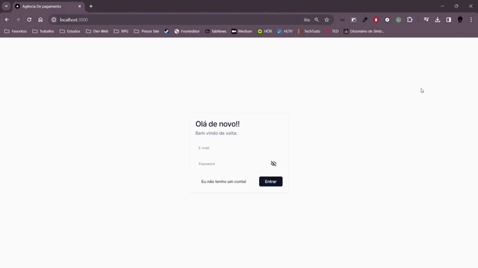

# Pagamentos APP




# Sistema de Pagamentos

Este projeto é um sistema de pagamentos desenvolvido para treinar habilidades de programação, utilizando [Next.js](https://nextjs.org/), [TypeScript](https://www.typescriptlang.org/), [Tailwind CSS](https://tailwindcss.com/), [ui.shadcn](https://shadcn.github.io/ui/) e [Firebase](https://firebase.google.com/) para a persistência dos dados. Através desta aplicação, os usuários podem se registrar, entrar na plataforma, cadastrar saldos e pagamentos, com o objetivo de gerenciar suas finanças pessoais de maneira eficaz.

## Funcionalidades

- **Autenticação**: Login e logout.
- **Pagamentos**:
  - Criar, visualizar, editar e apagar pagamentos.
  - Atributos: Nome, Descrição, Valor, Saldo Vinculado.
- **Saldos**:
  - Criar, visualizar, editar e apagar saldos.
  - Atributos: Nome, Descrição, Valor Inicial, Valor Restante.

## Regras de Negócio

- O sistema gerencia o valor restante de um saldo.
- Impede vinculação de um saldo a um pagamento se o saldo restante for insuficiente.
- Bloqueia a exclusão de um saldo vinculado a um pagamento.
- Atualiza o valor restante do saldo ao criar ou excluir um pagamento.

## Requisitos

- [Node.js](https://nodejs.org/en/)
- Uma conta no [Firebase](https://firebase.google.com/)

## Instalação

1. Clone o repositório:
   ```bash
   git clone <https://github.com/AndersonAlvesCoelho/payments-app>
   ```

</table>

## 📝 Licença

Esse projeto está sob licença. Veja o arquivo [LICENÇA](LICENSE.md) para mais detalhes.
